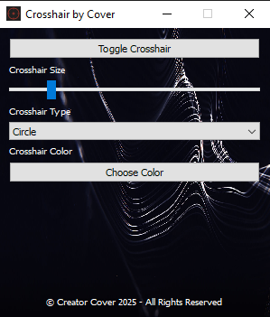
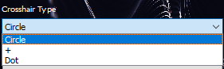

# Crosshair Overlay App

A simple, customizable crosshair overlay application built with Python and PyQt5.

---

## Features

- Custom crosshair shapes: Circle, Plus (+), and Dot  
- Adjustable crosshair size and color  
- Toggle visibility on and off  
- Always stays on top of other windows and applications  
- Lightweight and easy to use  

---

## Screenshots




---

## Installation

1. Make sure you have Python 3.6+ installed.  
2. Install required dependencies:

```bash
pip install PyQt5
